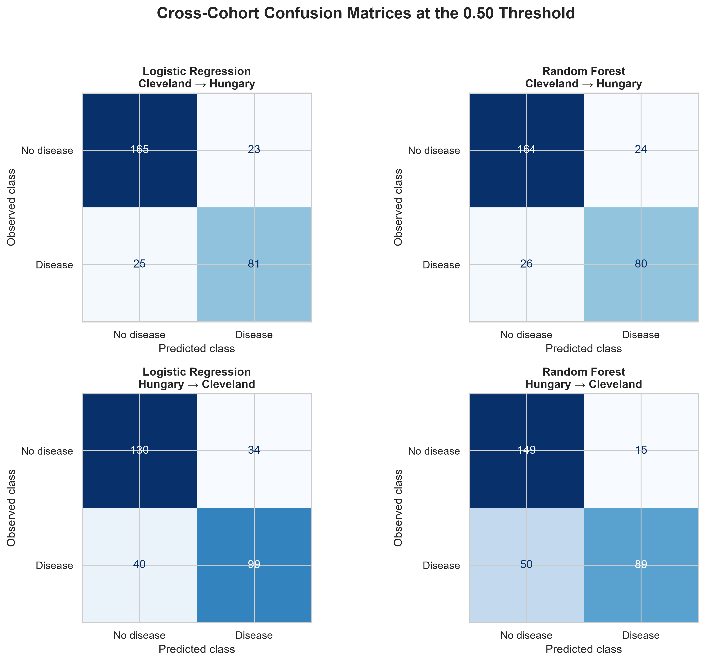

# CardioModel Shift

### Cross-population audit of heart-disease classification models

[](https://cardiomodel-shift-maxpearson.streamlit.app/)
[](https://www.python.org/)
[](https://scikit-learn.org/)

**[Try the live CardioModel Shift interface](https://cardiomodel-shift-maxpearson.streamlit.app/)**

CardioModel Shift investigates whether machine-learning models trained using one patient population maintain their performance when evaluated using another.

Using 597 historical patient records from the Cleveland and Hungarian cohorts of the UCI Heart Disease collection, this project compares Logistic Regression and Random Forest across both transfer directions. The audit examines discrimination, classification errors, probability calibration, feature reliance and sensitivity to different train/test splits.

> **Responsible-use notice:** This is an educational analysis of public historical data. It is not a clinical diagnostic system, medical device or personal cardiovascular-risk calculator.

## Research question

**Does a heart-disease classification model remain reliable when evaluated on a patient cohort different from the one used for training?**

## Live model explorer

The [interactive Streamlit application](https://cardiomodel-shift-maxpearson.streamlit.app/) allows visitors to:

- Choose Cleveland or Hungary as the model’s training population
- Compare Logistic Regression and Random Forest
- Select anonymous historical examples from the opposite cohort
- Review the patient’s ten recorded input features
- View the predicted probability and classification at a 0.50 threshold
- Compare the prediction with the recorded dataset label
- Identify true positives, true negatives, false positives and false negatives
- Explore the project’s performance, calibration and feature-importance figures

The interface uses 20 reproducibly sampled public examples. Visitors select existing historical records rather than entering personal medical information.

The models used in the interface were fitted on each complete source cohort only after the evaluation design and model settings had been fixed. The interactive models are demonstration artifacts and are not used to make additional performance claims.

## Main finding

Cross-cohort performance was **asymmetric**.

Models trained in Cleveland transferred relatively well to Hungary. Models trained in Hungary showed a more consistent decline when evaluated in Cleveland.


Across 30 repeated stratified splits:

| Model | Transfer direction | Mean within-cohort ROC-AUC | Mean external ROC-AUC | Mean change | External ROC-AUC lower |
|---|---|---:|---:|---:|---:|
| Logistic Regression | Cleveland → Hungary | 0.874 | 0.878 | +0.004 | 56.7% of splits |
| Random Forest | Cleveland → Hungary | 0.866 | 0.889 | +0.023 | 33.3% of splits |
| Logistic Regression | Hungary → Cleveland | 0.897 | 0.846 | −0.052 | 83.3% of splits |
| Random Forest | Hungary → Cleveland | 0.893 | 0.853 | −0.040 | 90.0% of splits |


These results show that successful transfer in one direction does not guarantee equivalent performance in the reverse direction.

## Why this matters

A classification model can perform strongly in its development population while behaving differently elsewhere. Accuracy may also remain stable even when discrimination, calibration or sensitivity changes.

The project therefore evaluates several complementary properties:

| Metric | What it measures |
|---|---|
| ROC-AUC | How well the model ranks positive patients above negative patients |
| PR-AUC | Positive-case retrieval while accounting for false positives |
| Accuracy | Overall proportion of correct classifications |
| Sensitivity | Proportion of recorded positive cases detected |
| Specificity | Proportion of recorded negative cases correctly ruled out |
| Brier score | Error in predicted probabilities; lower is better |
| Calibration curve | Agreement between predicted probabilities and observed outcome frequency |

No metric is treated as sufficient on its own.

## Dataset

The project uses the processed Cleveland and Hungarian cohorts from the [UCI Heart Disease collection](https://archive.ics.uci.edu/dataset/45/heart+disease).

| Cohort | Patient records | Recorded disease cases | Disease prevalence |
|---|---:|---:|---:|
| Cleveland | 303 | 139 | 45.9% |
| Hungary | 294 | 106 | 36.1% |
| **Total** | **597** | **245** | **41.0%** |

Cleveland records disease-severity values from 0 to 4, while Hungary uses values 0 and 1. Following the UCI definition, 0 was classified as no recorded heart disease and every value above 0 as recorded heart disease.

The resulting outcome represents existing recorded disease rather than future cardiovascular risk.

The unprocessed `cleveland.data` file was excluded because the warning supplied with the collection identifies it as corrupted. The processed 14-variable Cleveland file was used instead.

Raw files are excluded from version control. Their provenance, download instructions and exclusion criteria are documented in [`data/raw/README.md`](data/raw/README.md).

## Feature harmonisation

Ten variables with meaningful coverage in both cohorts were retained.

### Numeric features

- Age
- Resting blood pressure
- Serum cholesterol
- Maximum heart rate
- ST depression

### Categorical features

- Sex
- Chest-pain type
- Fasting blood-sugar category
- Resting ECG category
- Exercise-induced angina

`st_slope`, `major_vessels` and `thalassemia` were excluded because they were extensively missing in the Hungarian cohort.

Missing numeric values were replaced using training-set medians. Missing categorical values were replaced using the most frequent training category. Numeric scaling and categorical one-hot encoding were also fitted using training patients only.

## Population-shift audit

The cohorts differed before modelling:

- Cleveland patients were approximately 6.6 years older on average.
- Age produced a standardised difference of 0.78.
- Maximum heart rate and ST depression showed moderate differences.
- Resting ECG distributions differed substantially.
- Chest-pain categories also differed.
- Disease prevalence was 45.9% in Cleveland and 36.1% in Hungary.


The data cannot establish whether these differences arose from patient populations, clinical measurement, diagnostic coding or other collection procedures.

## Modelling design

For each transfer direction:

1. The source cohort was divided into a stratified 75% training partition and 25% within-cohort test partition.
2. Missing-value handling, numeric scaling and categorical encoding were fitted using training patients only.
3. Logistic Regression and Random Forest were trained using the same features and patient split.
4. Each fitted model was evaluated on the held-out source patients.
5. The same fitted model was evaluated on the complete external cohort.
6. The experiment was repeated across 30 stratified splits.

Logistic Regression was used as the interpretable baseline. Random Forest represented a nonlinear comparison and used 500 trees with a minimum of five patients per terminal leaf.

## Error analysis

Random Forest generally produced stronger external ROC-AUC, but it did not dominate every metric.

In the original Hungary-to-Cleveland split:

- Logistic Regression produced 34 false positives and 40 false negatives.
- Random Forest produced 15 false positives and 50 false negatives.

Random Forest reduced false positives but missed more recorded positive cases at the 0.50 threshold. This demonstrates why stronger ranking performance does not automatically provide the preferred classification behaviour.



The preferred balance between false negatives and false positives would depend on a defined clinical context that is outside the scope of this project.

## Calibration

Calibration assesses whether predicted probabilities agree with observed outcome frequencies.

Probability performance was more stable during Cleveland-to-Hungary transfer. During Hungary-to-Cleveland transfer, mean Brier scores worsened by 0.038 for Logistic Regression and 0.031 for Random Forest across the repeated splits.


The calibration curves use six probability groups because the cohorts are small. Individual fluctuations should therefore be interpreted descriptively.

## Model explanation

Permutation importance measured how much external ROC-AUC changed when each original feature was shuffled repeatedly.

Chest-pain type and ST depression were the most consistently influential external features. Sex and exercise-induced angina made smaller but recurring contributions.

Age and resting ECG differed substantially between cohorts but showed comparatively little external permutation importance. This demonstrates that a feature can shift between populations without being a major driver of model predictions.


Permutation importance describes model reliance. It does not establish causal effects or clinical importance.

## Repository structure

```text
cardiomodel-shift/
├── data/
│   ├── demo/
│   │   ├── README.md
│   │   └── patient_examples.csv
│   └── raw/
│       └── README.md
├── models/
│   ├── logistic_regression_cleveland.joblib
│   ├── logistic_regression_hungary.joblib
│   ├── random_forest_cleveland.joblib
│   ├── random_forest_hungary.joblib
│   └── model_manifest.csv
├── notebooks/
│   └── cardiomodel_shift_analysis.ipynb
├── outputs/
│   ├── figures/
│   └── metrics/
├── streamlit_app.py
├── .gitignore
├── README.md
└── requirements.txt
```

## Run the interactive application locally

Create and activate a Python virtual environment, then install the dependencies:

```powershell
python -m venv .venv
.\.venv\Scripts\Activate.ps1
python -m pip install -r requirements.txt
```

Start the interface:

```powershell
streamlit run streamlit_app.py
```

The application uses the committed demonstration records and fitted model pipelines, so the raw source files are not required to run the interface.

## Reproduce the complete analysis

1. Clone or download this repository.
2. Create and activate a Python virtual environment.
3. Install `requirements.txt`.
4. Download the UCI Heart Disease collection from the official source.
5. Place `processed.cleveland.data` and `processed.hungarian.data` under:

```text
data/raw/uci_heart_disease/
```

6. Open `notebooks/cardiomodel_shift_analysis.ipynb`.
7. Select the project `.venv` as the notebook kernel.
8. Restart the kernel and run every cell from top to bottom.

The notebook recreates the metrics, figures, demonstration records and deployment models.

## Limitations

- The dataset is small, historical and not representative of current general populations.
- Only two cohorts from one public collection were evaluated.
- Outcome detail differs between cohorts and was harmonised into a binary label.
- Several potential predictors were excluded because of extensive missingness.
- One identical Hungarian record pair could not be confirmed as duplication because no patient identifier was available.
- Repeated splitting measures sensitivity to source-cohort allocation but does not create new independent external cohorts.
- PR-AUC depends on outcome prevalence.
- Calibration estimates are based on small samples.
- The fixed 0.50 threshold was not selected for a clinical use case.
- Permutation importance measures model reliance rather than causation.
- Saved model files depend on compatible Python and package versions.
- The live interface demonstrates historical model behaviour and cannot assess an individual’s health.

## Responsible use

This repository and its live interface demonstrate an educational machine-learning evaluation workflow. They must not be used for diagnosis, treatment decisions, screening or individual patient assessment.

## Data citation

Janosi, A., Steinbrunn, W., Pfisterer, M., and Detrano, R. (1989). *Heart Disease*. UCI Machine Learning Repository. [https://doi.org/10.24432/C52P4X](https://doi.org/10.24432/C52P4X)