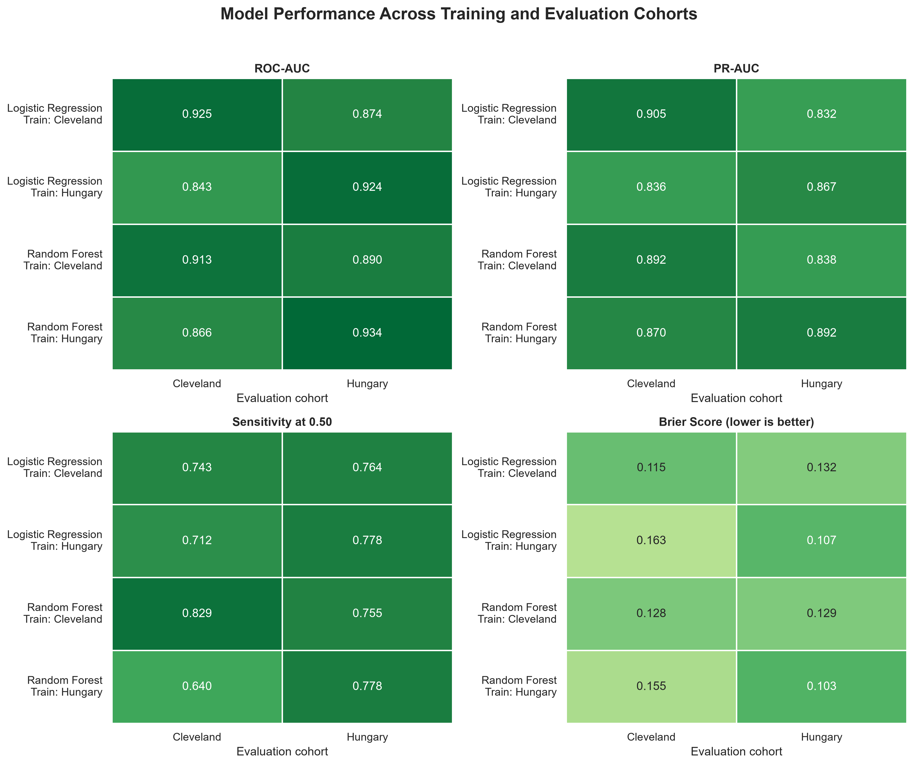
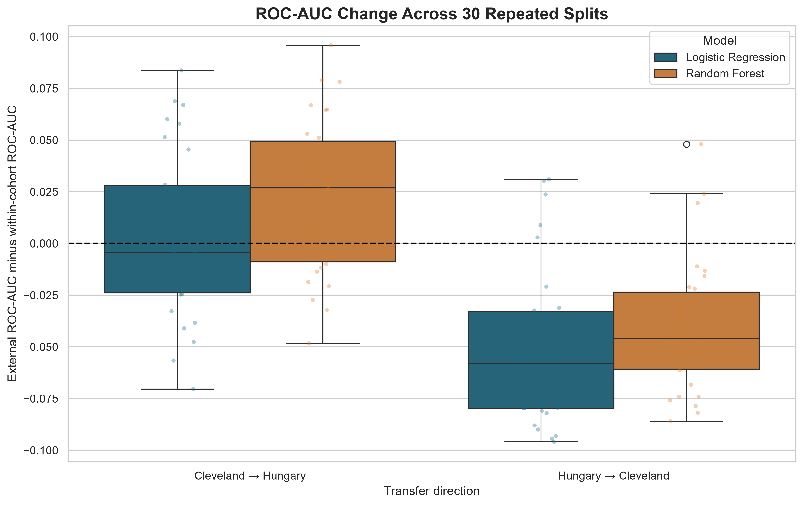
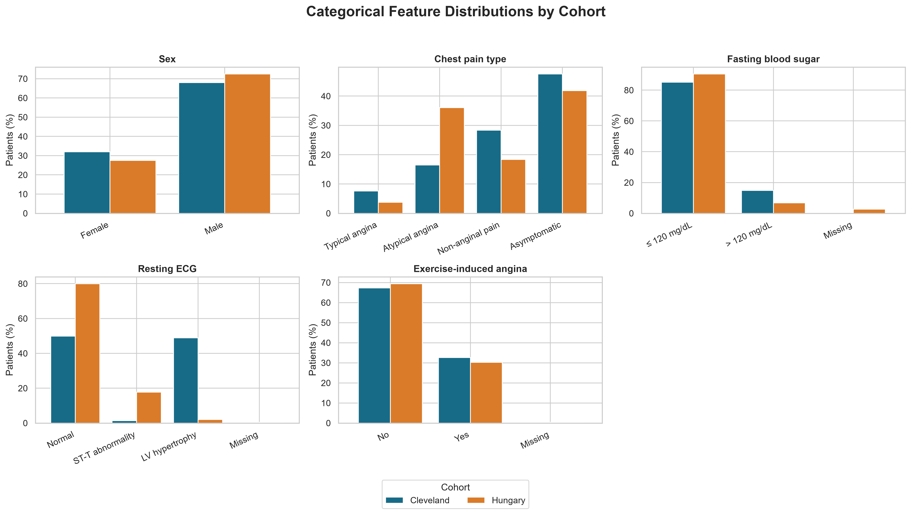
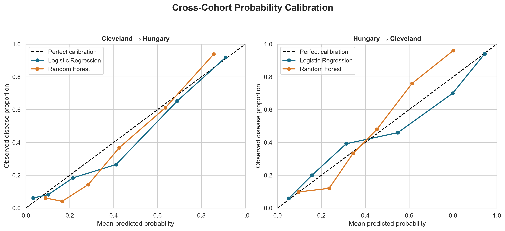
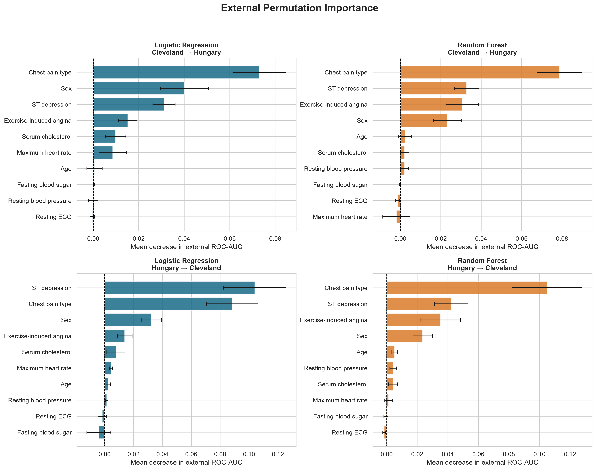

# CardioModel Shift

### Cross-population audit of heart-disease classification models

CardioModel Shift investigates whether machine-learning models trained using one patient population maintain their performance when evaluated using another.

Using 597 patient records from the Cleveland and Hungarian cohorts of the UCI Heart Disease collection, this project compares Logistic Regression and Random Forest across both transfer directions. The analysis examines discrimination, classification errors, probability calibration, feature reliance and sensitivity to different train/test splits.

> This is an educational analysis of public historical data. It is not a clinical diagnostic system or medical device.

## Research question

**Does a heart-disease classification model remain reliable when evaluated on a patient cohort different from the one used for training?**

## Main result

Cross-cohort performance was asymmetric.

Models trained in Cleveland transferred relatively well to Hungary. Models trained in Hungary showed a more consistent performance decline when evaluated in Cleveland.



Across 30 repeated stratified splits:

| Model | Transfer direction | Mean within-cohort ROC-AUC | Mean external ROC-AUC | Mean change | External ROC-AUC lower |
|---|---|---:|---:|---:|---:|
| Logistic Regression | Cleveland → Hungary | 0.874 | 0.878 | +0.004 | 56.7% of splits |
| Random Forest | Cleveland → Hungary | 0.866 | 0.889 | +0.023 | 33.3% of splits |
| Logistic Regression | Hungary → Cleveland | 0.897 | 0.846 | −0.052 | 83.3% of splits |
| Random Forest | Hungary → Cleveland | 0.893 | 0.853 | −0.040 | 90.0% of splits |



## Why this matters

A model can achieve strong performance in its development population while behaving differently elsewhere. Accuracy may also remain stable even when ranking performance, calibration or sensitivity deteriorates.

This project therefore evaluates several complementary properties:

- **ROC-AUC:** ranking of positive patients above negative patients
- **PR-AUC:** positive-case retrieval performance
- **Sensitivity:** proportion of positive cases detected at the 0.50 threshold
- **Specificity:** proportion of negative cases correctly ruled out
- **Brier score:** accuracy of predicted probabilities
- **Calibration curves:** agreement between predicted probabilities and observed outcome rates

## Data

The project uses the processed Cleveland and Hungarian cohorts from the [UCI Heart Disease dataset](https://archive.ics.uci.edu/dataset/45/heart+disease).

| Cohort | Patient records | Recorded disease cases | Disease prevalence |
|---|---:|---:|---:|
| Cleveland | 303 | 139 | 45.9% |
| Hungary | 294 | 106 | 36.1% |
| **Total** | **597** | **245** | **41.0%** |

The Cleveland outcome is recorded from 0 to 4, while Hungary uses 0 and 1. Following the UCI definition, 0 was classified as no recorded heart disease and every value above 0 as recorded heart disease.

The outcome represents existing recorded disease rather than future cardiovascular risk.

Raw files are excluded from version control. Download instructions, provenance and the corrupted-file exclusion are documented in [`data/raw/README.md`](data/raw/README.md).

## Feature harmonisation

Ten variables with meaningful coverage in both cohorts were retained:

### Numeric features

- Age
- Resting blood pressure
- Serum cholesterol
- Maximum heart rate
- ST depression

### Categorical features

- Sex
- Chest-pain type
- Fasting blood-sugar category
- Resting ECG category
- Exercise-induced angina

`st_slope`, `major_vessels` and `thalassemia` were excluded because they were extensively missing in the Hungarian cohort.

Missing numeric values were replaced with training-set medians. Missing categorical values were replaced with the most frequent training category. Numeric scaling and categorical one-hot encoding were also learned from training data only.

## Cohort differences

The cohorts differed before modelling:

- Cleveland patients were approximately 6.6 years older on average.
- Maximum heart rate and ST depression showed moderate standardised differences.
- Resting ECG distributions differed substantially.
- Chest-pain categories also differed between cohorts.
- Disease prevalence was 45.9% in Cleveland and 36.1% in Hungary.

These differences may reflect patient populations, clinical measurement, coding practices or other collection procedures. The dataset cannot identify their causes.



## Modelling design

For each transfer direction:

1. The source cohort was divided into a stratified 75% training set and 25% within-cohort test set.
2. Preprocessing was fitted using only the training patients.
3. Logistic Regression and Random Forest were fitted using the same features and patient split.
4. Each fitted model was evaluated on the held-out source patients.
5. The same model was then evaluated on the complete external cohort.
6. The process was repeated across 30 different stratified splits.

Logistic Regression was used as the interpretable baseline. Random Forest represented a nonlinear comparison and used 500 trees with a minimum of five patients per terminal leaf.

## Error and calibration findings

Random Forest generally achieved stronger cross-cohort ROC-AUC, but it did not dominate every metric.

During Hungary-to-Cleveland transfer, Random Forest produced fewer false positives than Logistic Regression but more false negatives. At the 0.50 threshold, stronger ranking performance therefore did not translate into higher sensitivity.

Probability calibration also shifted. Mean Brier scores worsened for both models during Hungary-to-Cleveland transfer, while Cleveland-to-Hungary probability performance was more stable.



## Model explanation

Permutation importance measured how much external ROC-AUC fell when each original feature was shuffled.

Chest-pain type and ST depression were the most consistently influential external features. Age and resting ECG differed substantially between cohorts but showed relatively little external importance.

This distinction matters: a feature can shift between populations without being a major driver of model predictions.



Permutation importance describes model reliance. It does not establish causal effects or clinical importance.

## Repository contents

```text
cardiomodel-shift/
├── data/
│   └── raw/
│       └── README.md
├── notebooks/
│   └── cardiomodel_shift_analysis.ipynb
├── outputs/
│   ├── figures/
│   └── metrics/
├── .gitignore
├── README.md
└── requirements.txt
```

## Reproduce the analysis

1. Clone or download this repository.
2. Create and activate a Python virtual environment.
3. Install the required packages:

```powershell
python -m pip install -r requirements.txt
```

4. Download the UCI Heart Disease collection from the official source.
5. Place `processed.cleveland.data` and `processed.hungarian.data` under:

```text
data/raw/uci_heart_disease/
```

6. Open `notebooks/cardiomodel_shift_analysis.ipynb`.
7. Select the project virtual environment as the notebook kernel.
8. Restart the kernel and run all cells from top to bottom.

The notebook recreates the metrics tables and figures under `outputs/`.

## Limitations

- The data are small, historical and not representative of current general populations.
- Only two cohorts from one public collection were evaluated.
- Outcome detail differs between cohorts and was harmonised into a binary label.
- Several potential predictors were excluded because of extensive missingness.
- One identical Hungarian record pair could not be confirmed as duplication because no patient identifier was available.
- Repeated splitting assesses training-sample sensitivity but does not create additional independent external cohorts.
- PR-AUC is affected by outcome prevalence.
- Calibration estimates are based on small samples.
- The 0.50 classification threshold was not selected for a clinical use case.
- Model importance does not imply causation or clinical significance.

## Responsible use

This repository demonstrates an educational machine-learning evaluation workflow. The models must not be used for diagnosis, treatment decisions or individual patient assessment.

## Data citation

Janosi, A., Steinbrunn, W., Pfisterer, M., and Detrano, R. (1989). *Heart Disease*. UCI Machine Learning Repository. https://doi.org/10.24432/C52P4X